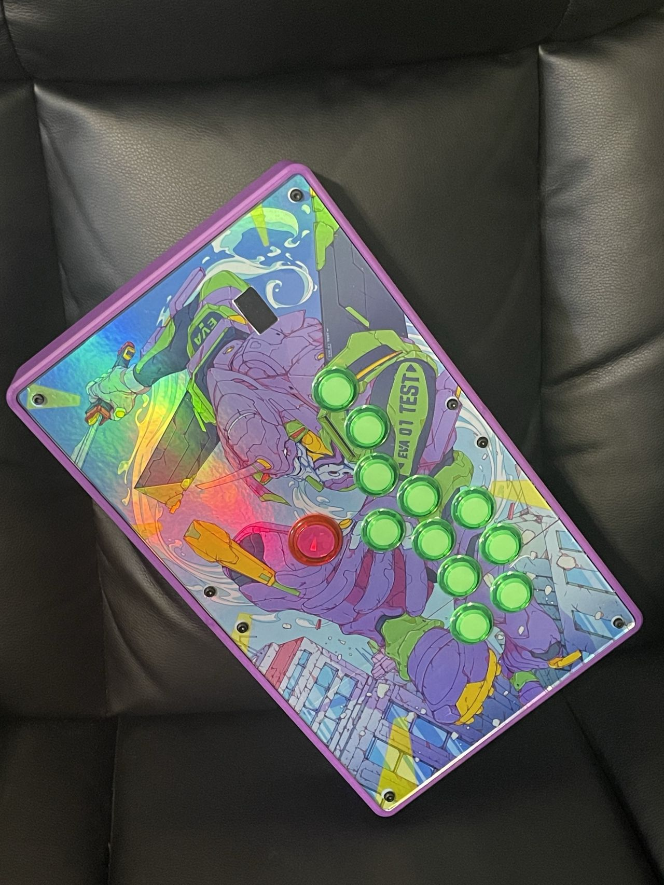
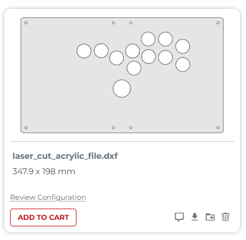
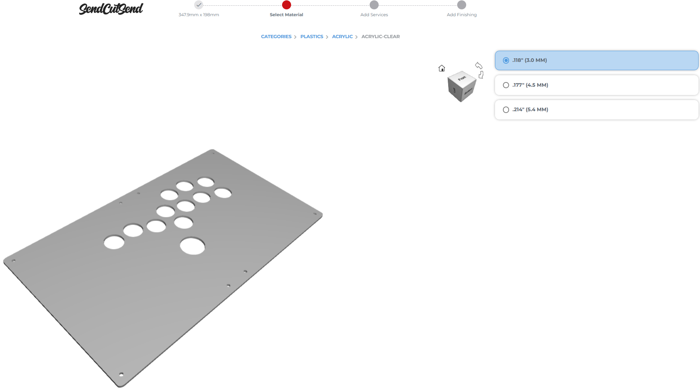

# Open Stick Remix - 3D Printable Leverless Arcade Controller by donburgers

 This project is my remixed version of the **Open Stick**, an open-source, 3D printable, full-sized arcade stick originally designed by **TheTrain**. This version is focused on a leverless configuration.

**Original Project:** [Open Stick by TheTrain on Printables.com](https://www.printables.com/model/858059-open-stick-open-source-3d-printable-full-sized-arc)
**Original Creator:** TheTrain (@TheTrain_2013092 on Printables.com)

---

## About This Remix by donburgers

## About This Remix by donburgers

This remix adapts TheTrain's original Open Stick for a specific leverless configuration with the following key modifications:

* **Top Left Plate (`Open Stick - 3D Printable Case - Top Left Plate.stl`):**
    * Converted the traditional lever opening to a 4-button directional layout (e.g., for WASD-style movement).
    * Integrated a slot specifically for a 0.96-inch OLED I2C display module, allowing for potential future integration of visual feedback or button mapping displays.
* **Top Right Plate (`Open Stick - 3D Printable Case - Top Right Plate (8x 30mm).stl`):**
    * Modified the action button layout from the original 8x 30mm holes to support 8x 24mm arcade buttons.

---

## Original Project Description (from TheTrain)

This is the Open Stick, a 3D printable full sized arcade stick. This is a modular design sized to fit most printers.

---

## Printing and Construction (Based on TheTrain's original notes)

This project is a work in progress. The files posted (in the original project) have been printed and work without issue. There are improvements that will be made and those files will be posted when I make them.
Please note that I am not taking on requests for other layouts at this time. The STLs posted can be easily edited in TinkerCAD or other programs. There is also a .STEP file included of the whole chase.

Please note that this was one of the first projects I did in Fusion360 and it may not be made correctly.

This case was printed on a Bambu Labs X1C and P1P printer with the following changes to settings:
- 3 outer walls (Bambu Lab - 3 Wall loops)
- Hex infill
- 15% infill
- Brim (for the main case frame parts only)
- Tree supports (for the main case frame parts only)

Based on my prints you can make an entire case from a single roll of filament.
This case was printed using Bambu Labs matte PLA filament, I have not tested it with other filament.

---

## Hardware Needed (Based on TheTrain's original list)

The following hardware is needed to assemble the case:
- 8 x M4 45mm brass standoffs
- 20 x M4 12-16mm countersunk hex bolts
- 8 x M4 25mm button top hex bolts
- 12 x M4 flange nuts
- 4 x M3 8mm button top hex bolts
- 2 x M3 12mm countersunk hex bolts
- 2 x M3 nuts

---

## Assembly (Based on TheTrain's original instructions)

- The M4 45mm brass standoffs slide into the 8x hex sockets in the left and right main frame. If these are tight please use a camp to force them in. Do not heat them for inserting. Future revisions will use an M4 heat insert.
- The M3 bolts are used to secure the PCB to the right top panel. Currently these just screw directly into the plate. Future revisions will use an M3 heat insert on the top plate.
- Four of the M4 12-16mm countersunk hex bolts are used to secure a Sanwa JLF or similar type joystick to the left top panel. This has space in it for a second JLF type dust washer. The JLF is then secured with 4x M4 flange nuts.
- The two case halves are secured with 8x M4 25mm button top hex bolts and 8x M4 flang nuts. The direction of these bolts is not important. While normal nuts can be used flange nuts are recommend.
- The remaining 16 M4 12-16mm bolts are used to secure the top and bottom plates to the unit. You can use many sizes here due to the 45mm standoffs being used. It is possible to convert this to an art case. To do that you can replace 8x or 4x of the top plate countersunk bolts with button top bolts. Doing this would also require modifications to the top plate files to make the holes non-countersunk.
- To mount a Neutrik passthrough you will need the 2x M3 12mm countersunk hex bolts and 2x M3 nuts. The Neutrik passthrough will be a tight fit and may need to be clamped into place.

---

## Optional: Ordering a Custom Acrylic Top Panel

For a professional finish for your top panel, you can order a laser-cut acrylic piece using a service like SendCutSend. This project includes a `.dxf` file specifically for the top panel.

**File to Use (Top Panel):** `laser_cut_acrylic_file.dxf`

**Recommended Specifications for Top Panel:**
* **Material:** Acrylic - Clear
* **Thickness:** .118" (3.0mm)

**Steps to Order from [SendCutSend.com](https://sendcutsend.com/):**

1.  **Navigate to SendCutSend:** Go to the [SendCutSend website](https://sendcutsend.com/).
2.  **Upload Your Design:**
    * Click on "Get Instant Quote" or "Upload File".
    * Upload the `laser_cut_acrylic_file.dxf` (for the top panel) from this repository.
    * Verify the dimensions shown on their site after upload (expected dimensions should be around 347.9mm x 198mm, but confirm with your specific DXF file).
3.  **Select Material:**
    * Choose "Plastics" as the material category.
    * Select "ACRYLIC".
    * Then select "ACRYLIC - CLEAR".
4.  **Select Thickness:**
    * Choose the ".118" (3.0 MM)" option for thickness.
5.  **Review Configuration & Add to Cart:**
    * Review the preview of your top panel, the selected material, thickness, and any other options.
    * Check the quoted price.
    * If everything looks correct, add the item to your cart.
6.  **Checkout:** Proceed through the checkout process to place your order.

**Example of SendCutSend Interface (for reference only):**

*(Based on images provided by user - these show the general selection process for a panel)*

*Image 1: File Uploaded (`laser_cut_acrylic_file.dxf`)*
* 

*Image 2: Material & Thickness Selection (Acrylic - Clear, .118" / 3.0mm)*
* *
[Description: SendCutSend interface showing material selection steps highlighting Acrylic - Clear and .118" (3.0mm) thickness.]

**Notes:**
* These instructions are specifically for the **top panel** using `laser_cut_acrylic_file.dxf`. If you create DXF files for other parts (like a bottom panel), you would repeat the process with those files.
* Always double-check your design, material selection, and thickness on the SendCutSend website before ordering.
* Prices will vary based on material, thickness, and design complexity.
* Lead times for manufacturing and shipping will be provided by SendCutSend.

---

## Files Included in This Remix Repository (by donburgers)

* 3D Printable Case - Bottom Left Plate.stl
* 3D Printable Case - Bottom Right Plate.stl
* 3D Printable Case - Main Left Frame.stl
* 3D Printable Case - Main Right Frame.stl
* 3D Printable Case - Top Left Plate.stl
* 3D Printable Case - Top Right Plate.stl
* For original chassis and other unmodified common parts, please refer to TheTrain's project page.
)*

---

## Technologies Used (for this Remix by donburgers)

* **3D CAD Software:** Fusion 360
* **PCB Design Software:** KiCad
* **Slicer Software:** Bambu Lab Slicer (or specify your slicer of choice, e.g., PrusaSlicer, Cura)

---

## License

This project is a remix of the "Open Stick - Open Source 3D printable full sized arcade stick" by TheTrain, available on [Printables.com](https://www.printables.com/model/858059-open-stick-open-source-3d-printable-full-sized-arc).

---
The following text must be included in any distribution of derivatives of this board. All links must also be included.

Based on the incredible work by Dash n'Mash.
Copyright 2023 TheTrain
Licensed under CC BY 4.0
---

The files and contributions in *this specific GitHub repository* (by donburgers) are licensed under (https://creativecommons.org/licenses/by/4.0/))*

---

## Acknowledgements

* Huge thanks to **TheTrain** for the original Open Stick design, for making it open source, and for the detailed printing and assembly instructions.
* Acknowledgement to **Dash n'Mash** for their foundational work mentioned in the original attribution.

---

## Contact / Feedback (donburgers)

* If you have any questions or feedback about this specific remix, feel free to open an issue in this repository.
